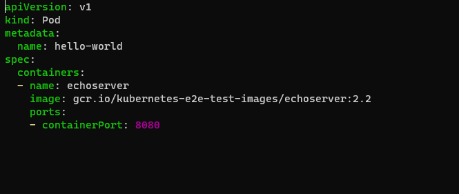
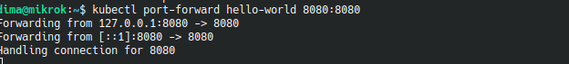
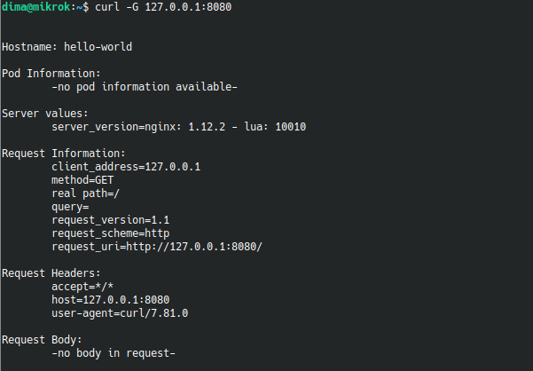
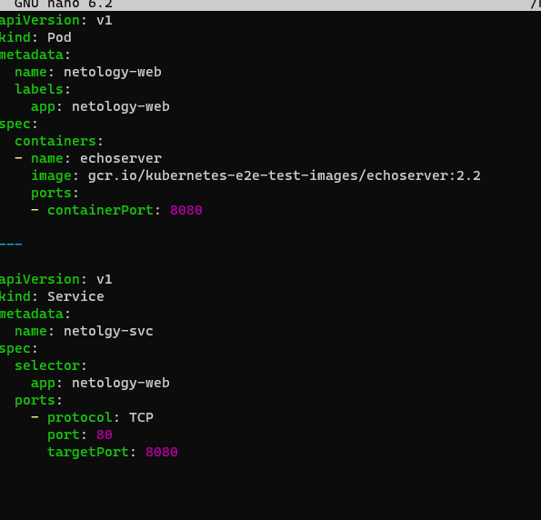
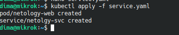
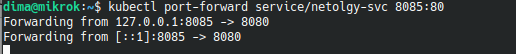
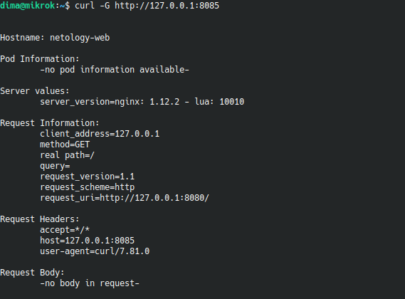

# «БАЗОВЫЕ ОБЪЕКТЫ K8S»

### Задание 1. 
*Создать Pod с именем hello-world*

*Создать манифест (yaml-конфигурацию) Pod.*

*Использовать image - gcr.io/kubernetes-e2e-test-images/echoserver:2.2.*

*Подключиться локально к Pod с помощью kubectl port-forward и вывести значение (curl или в браузере).*

Нарисан манифест:

Создан и запущен pod.

С помощью port-forward пробрасываю порт пода.

GET запрос:

-

### Задание 2. Создать Service и подключить его к Pod

*1. Создать Pod с именем netology-web.*

*2. Использовать image — gcr.io/kubernetes-e2e-test-images/echoserver:2.2.*

*3. Создать Service с именем netology-svc и подключить к netology-web.*

*4. Подключиться локально к Service с помощью `kubectl port-forward` и вывести значение (curl или в браузере).*

Манифест для создания пода и сервиса:

Запускаю под и сервис:

Подключаюсь локально к Service с помощью kubectl port-forward:

 GET запрос:
 
 
 
 Ссылки на манифест:
 
 https://github.com/dmistus/Kubernetes_02/tree/main/src

